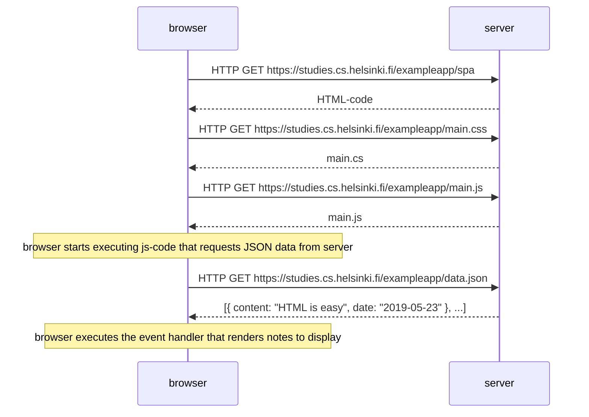

### Sequence diagram Mermaid syntax

```
sequenceDiagram
browser->>server: HTTP GET https://studies.cs.helsinki.fi/exampleapp/spa
server-->>browser: HTML-code
browser->>server: HTTP GET https://studies.cs.helsinki.fi/exampleapp/main.css
server-->>browser: main.cs
browser->>server: HTTP GET https://studies.cs.helsinki.fi/exampleapp/main.js
server-->>browser: main.js
Note over browser: browser starts executing js-code that requests JSON data from server 
browser->>server: HTTP GET https://studies.cs.helsinki.fi/exampleapp/data.json
server-->>browser: [{ content: "HTML is easy", date: "2019-05-23" }, ...]
Note over browser: browser executes the event handler that renders notes to display
```


