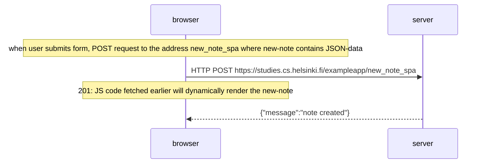

### Sequence diagram Mermaid syntax

```
sequenceDiagram
Note over browser: when user submits form, POST request to the address new_note_spa where new-note contains JSON-data
browser->>server: HTTP POST https://studies.cs.helsinki.fi/exampleapp/new_note_spa
Note over browser: 201: JS code fetched earlier will dynamically render the new-note
server-->>browser: {"message":"note created"}
```


